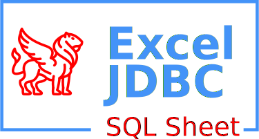

# [SQL Sheet 7 Website](https://manticore-projects.com/sqlsheet) 

[](https://github.com/panchmp/sqlsheet/actions/workflows/maven_deploy.yml)
[](https://github.com/panchmp/sqlsheet/actions/workflows/gradle.yml)
[](https://coveralls.io/r/panchmp/sqlsheet?branch=master)
[](https://www.codacy.com/gh/panchmp/sqlsheet/dashboard?utm_source=github.com&amp;utm_medium=referral&amp;utm_content=panchmp/sqlsheet&amp;utm_campaign=Badge_Grade)
[](http://maven-badges.herokuapp.com/maven-central/com.google.code.sqlsheet/sqlsheet)
[](https://www.javadoc.io/doc/com.google.code.sqlsheet/sqlsheet)
[](https://app.codacy.com/gh/manticore-projects/sqlsheet/dashboard?utm_source=gh&utm_medium=referral&utm_content=&utm_campaign=Badge_grade)

## Summary

**SQLSheet** is a **JDBC driver for Excel XLS/XLSX spreadsheets** based Apache POI and JSQLParser with support for:

- `SELECT FROM` statements
- `INSERT INTO` statements
- `DELETE FROM` statements
- `CREATE TABLE` statements
- `DROP TABLE` statements
- Custom Sheet Headers
- Streaming Mode of large data sets
- Database and ResultSet MetaData
- Formula Evaluation

A `Catalog` defines the folder of the ``*.xls(x)`` files and the `Schema` sets the filename of each ``*.xls(x)`` file. Every sheet represents a `Table` and its `Fields` are defined by the sheet columns.

The goal is to **extract or insert data** from and into the spreadsheets with SQL statements only. There is **no DB Engine or support for any advanced SQL features** beyond access of simple data frames.
Although it would be very easy to transfer data to a Java In Memory Database like H2, HyperSQL or DuckDB for this purpose.

## License

**SQLSheet** is licensed under the Apache License, Version 2.0 (the "License").

## Maven Artifact:
```xml
<dependency>
    <groupId>com.google.code.sqlsheet</groupId>
    <artifactId>sqlsheet</artifactId>
    <version>[7.1,]</version>
</dependency>
```


## Usage example:
 * [Java code example](http://code.google.com/p/sqlsheet/wiki/HowToMaven)
 * [Scriptella driver](http://scriptella.javaforge.com/docs/api/scriptella/driver/xls/package-summary.html#package_description)
 * [driver](https://code.google.com/p/sqlsheet/source/browse/trunk/sqlsheet/src/test/resources/xlsload.xml) in [ unit test](https://code.google.com/p/sqlsheet/source/browse/trunk/sqlsheet/src/test/java/com/googlecode/sqlsheet/XlsDriverIntegrationTest.java)

```java
Class.forName("com.googlecode.sqlsheet.Driver");

Connection writeConnection = DriverManager.getConnection("jdbc:xls:file:test.xlsx");

Statement writeStatement = writeConnection.createStatement();

writeStatement.executeUpdate("CREATE TABLE TEST_INSERT(COL1 INT, COL2 VARCHAR(255), COL3 DATE)");

PreparedStatement writeStatement2 =
writeConnection.prepareStatement("INSERT INTO TEST_INSERT(COL1, COL2, COL3) VALUES(?,?,?)");

for(int i = 0; i<3;i++){
  writeStatement2.setDouble(1, i);
  writeStatement2.setString(2, "Row" + i);
  writeStatement2.setDate(3, new java.sql.Date(new Date().getTime()));
  writeStatement2.execute();
}

writeStatement.close();
writeStatement2.close();
writeConnection.close();
```

```xml
<!DOCTYPE etl SYSTEM "http://scriptella.javaforge.com/dtd/etl.dtd">
<etl>

  <connection id="xls" url="jdbc:xls:file:extracttest.xls"/>
  <connection id="xlsx" url="jdbc:xls:file:extracttest.xlsx"/>
  <connection id="java" driver="janino"/>

  <script connection-id="xls">
    CREATE TABLE "2009"(
      COL1 INT,
      COL2 VARCHAR(255),
      COL3 DATE
    );
  </script>

  <script connection-id="xlsx">
    CREATE TABLE "2009"(
      COL1 INT,
      COL2 VARCHAR(255),
      COL3 DATE
    );
  </script>

  <query connection-id="java">
    set("COL1", 1);
    set("COL2", "Test");
    set("COL3", new java.util.Date());
    next();
    <script connection-id="xls">
      INSERT INTO "2009" (COL1, COL2, COL3) VALUES(?COL1, ?COL2, ?COL3);
    </script>
    <script connection-id="xlsx">
      INSERT INTO "2009" (COL1, COL2, COL3) VALUES(?COL1, ?COL2, ?COL3);
    </script>
  </query>

</etl>
```

```xml
<!DOCTYPE etl SYSTEM "http://scriptella.javaforge.com/dtd/etl.dtd">
<etl>

  <connection id="xls" url="jdbc:xls:file:extracttest.xls"/>
  <connection id="xlsx" url="jdbc:xls:file:extracttest.xlsx"/>
  <connection id="java" driver="janino"/>

  <query connection-id="xls">
    SELECT * FROM "2009";
    <script connection-id="java">
      System.out.println(((Double)get("COL1")).intValue());
      System.out.println((String)get("COL2"));
      System.out.println((java.util.Date) get("COL3"));
    </script>
  </query>

  <query connection-id="xlsx">
    SELECT * FROM "2009";
    <script connection-id="java">
      System.out.println(((Double)get("COL1")).intValue());
      System.out.println((String)get("COL2"));
      System.out.println((java.util.Date) get("COL3"));
    </script>
  </query>

</etl>
```

## Donate
[](https://paypal.me/panchmp)
